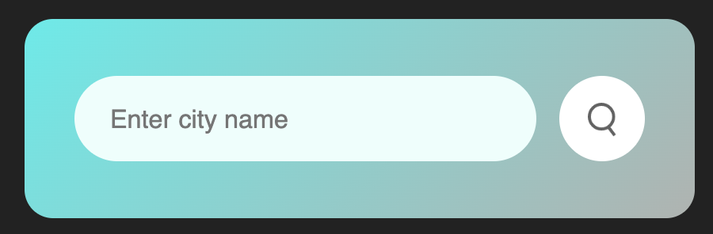
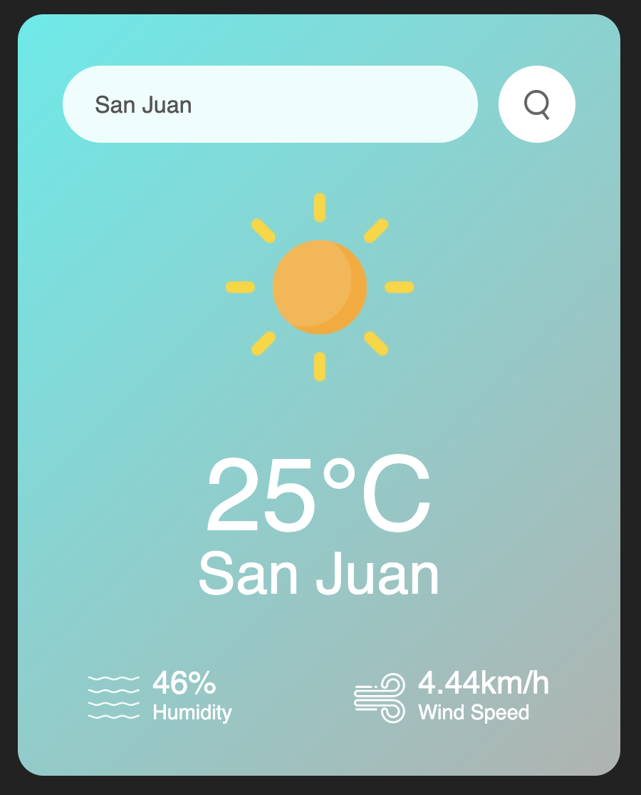
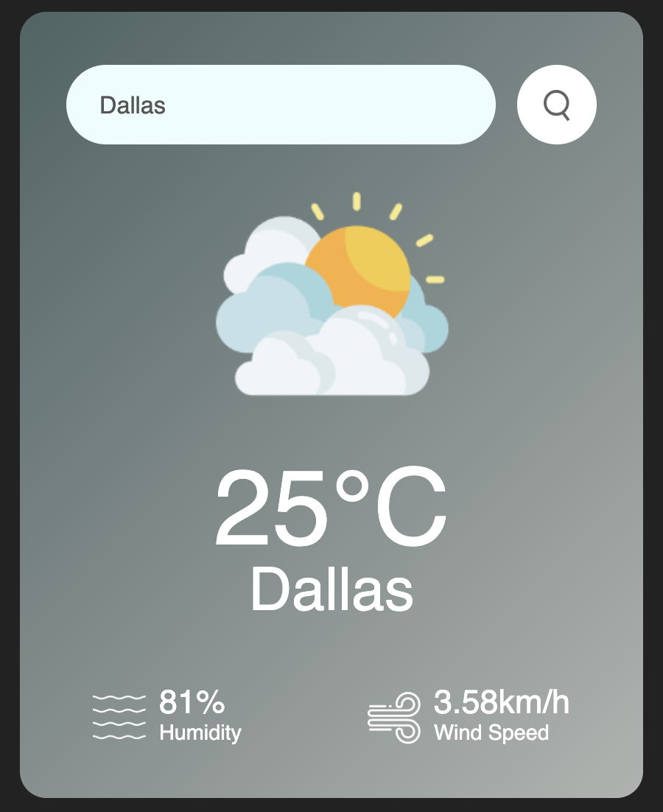

# Weather App

A simple weather application that displays the current weather of any city using the OpenWeatherMap API. Developed with HTML, CSS, and JavaScript.

## Features
- Shows the current weather for any entered city.
- Displays information on temperature, humidity, and wind speed.
- Clean and user-friendly interface.

## Technologies Used
- **HTML**: Content structure.
- **CSS**: Visual styling.
- **JavaScript**: Logic and communication with the OpenWeatherMap API.

## Prerequisites
To run this application, you’ll need an [API Key de OpenWeatherMap](https://home.openweathermap.org/users/sign_up).

## Setup
1. Clone this repository:
   ```bash
   git clone https://github.com/yourusername/weather-app.git
   ```
2. Navigate to the project folder:
    ```bash
    cd weather-app
    ```
3. Open the script.js file and replace the apiKey value with your own OpenWeatherMap API Key:
    ```javascript
    const apiKey = "YOUR_API_KEY_HERE";
    ```
## Running Locally

### Option 1: Open the HTML file
1. Open `index.html` directly in your browser (for quick testing without API requests).

### Option 2: Use a local server with Visual Studio Code and Live Server
1. Ensure [Visual Studio Code](https://code.visualstudio.com/) is installed.
2. Install the **Live Server** extension in Visual Studio Code.
3. Right-click `index.html` and select **Open with Live Server**.

The app will automatically open in your browser at `http://127.0.0.1:5500`.

## Usage
1. Enter the name of the city you want to check in the search field.
2. Click the search button.
3. The app will display the city’s current temperature, humidity, and wind speed.

## Project Structure

```plaintext
weather-app/
├── images            # Images used
├── index.html        # Page structure
├── style.css         # Application styling
├── script.js         # Application logic
└── README.md         # Project documentation
```

## Screenshots




## Contributing
Contributions are welcome! For major changes, please open an issue first to discuss what you would like to change.
